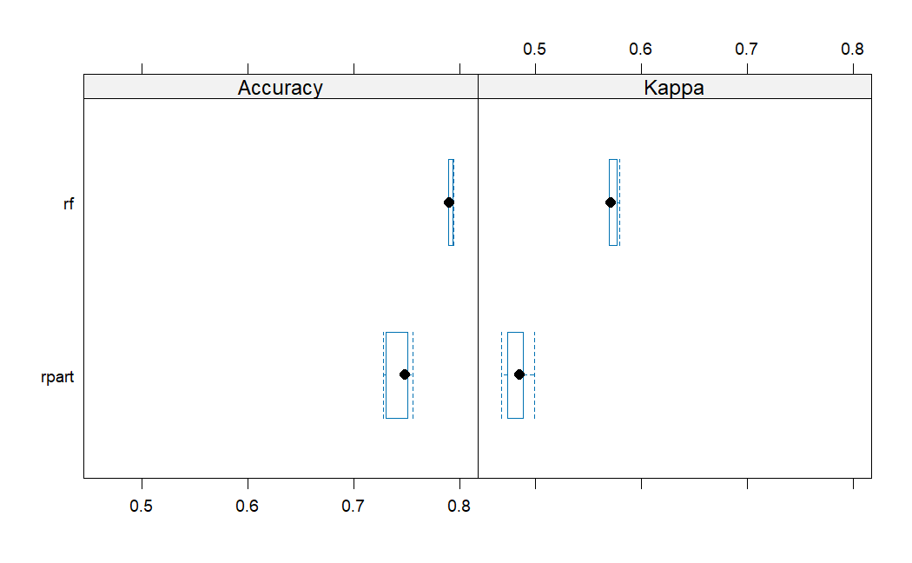

```{r setup, include=FALSE}
knitr::opts_chunk$set(echo = FALSE)
```

## Plot 1

{width="700"}

## Plot 2

{width="700"}

## Plot 3

{width="700"}

## Plot 4

{width="700"}

## Plot 5

{width="700"}

## Plot 6

{width="700"}

## Plot 7

{width="700"}

## Plot 8

{width="700"}

## Plot 9

{width="700"}

## Plot 10

{width="700"}

## Part 2: Predictive Models

## Predicting High/Low Charge

{width="350"}

{width="350"}

## Tuning Parameters

##### Random Forest:

{width="350"}

##### Rpart:

{width="350"}

## Model Comparison

{width="700"}

Random Forest Accuracy: 0.7924803

## Predicting Age (over or under 50 years old)

{width="350"}

{width="350"}

## Tuning Parameters

###### Random Forest:

{width="350"}

##### Rpart:

{width="350"}

## Model Comparison

{width="700"}

Random Forest Accuracy: 0.8172072

## Takeaways

-   The toughest part was trying to knit the entire file

    -   Helped to save data as a csv

    -   Also helped to limit the tuning parameters and number of trees in a RF

-   Provider is a key indicator for predicting age and total charge

-   For this dataset RF is more accurate than Rpart
